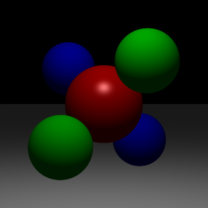
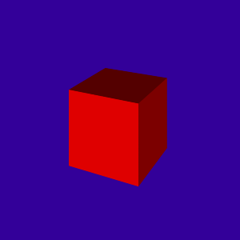
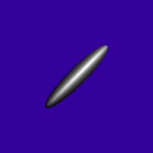
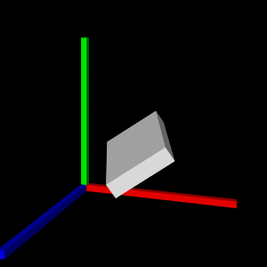
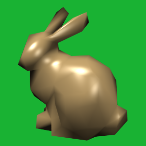
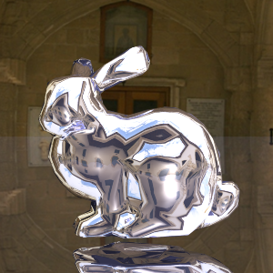
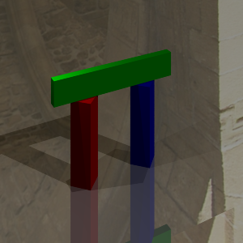
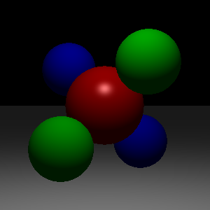
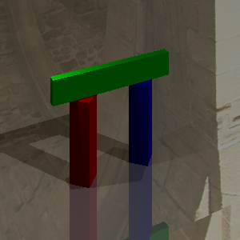

# PJ2：光照模型与光线追踪实验报告

- 姓名：郭诣丰、郑岩
- 专业：计算机科学与技术（拔尖人才试验班）
- 代码仓库地址：https://github.com/NephrenLuca/graphicsh/tree/main/PJ2
- 指导老师：颜波
- 实验日期：2026.4.23-2026.5.21

感谢助教在实验过程中提供的帮助和指导！

---

## 目录
1. 前情部分
2. 实验内容
3. 运行结果
4. 实验分工
5. 收获与感想

---

## 1. 前情部分

本次 PJ2 的主题是光照模型与光线追踪。目标是让我们在给定 C++ 框架中，从基础光线投射，逐步扩展到递归光线追踪，最终得到包含阴影、反射和抗锯齿效果的渲染结果。
虽然 PJ2 开始时，只上完前五课，颜老师还未讲到后续的光线追踪和抗锯齿内容，但我们通过自行查找资料和教材、询问 AI，提前预习了相关知识点，就能尝试开始编写代码。

根据项目说明，我们将实验要求拆成三条主线：

1. 任务1：实现 Phong 光照模型，包括点光源照明、漫反射和镜面反射
2. 任务2：实现关键几何体相交，完成 ray casting，正确渲染 Scene1-5
3. 任务3：实现递归反射与阴影，完成 ray tracing，正确渲染 Scene6-7

此外，我们还完成了拓展任务，也就是抗锯齿的问题：

1. 在 `Renderer::Render()` 中实现 `-jitter` 抖动采样
2. 在 `Renderer::Render()` 中实现 `-filter` 上采样+高斯下采样

接下来叙述实验中具体的方法，代码编写，以及最终得到的结果。

---

## 2. 实验内容

### 2.1 实验准备

#### 2.1.1 代码框架分析

在助教提供的基本框架 `starter2` 下，工程的核心路径如下：

1. `src/Renderer.cpp`：渲染主循环与 `traceRay` 主逻辑
2. `src/Light.cpp`：光源照明参数计算
3. `src/Material.cpp`：材质着色（Phong）
4. `src/Object3D.cpp`：几何相交（Plane/Triangle/Transform）
5. `data/scene*.txt`：场景描述输入

我们仔细阅读了这些核心代码并进行了分析。程序的执行流程是：

1. 场景解析器先读取 `scene` 文件，构造相机、光源、材质、物体
2. 对每个像素由相机生成主光线
3. `traceRay` 计算命中、着色、阴影与反射
4. 写回图像并输出 PNG

#### 2.1.2 实现路线

为了减少调试难度，我们按照PPT中建议的流程来逐个完成：

1. 先完成 Phong，确认球体明暗正确
2. 再补齐几何相交，确认 Scene1-5 物体都能出现
3. 再加入阴影和反射，确认 Scene6-7 视觉现象正确
4. 最后做抗锯齿，对比 base 与 aa 效果（`aa` 为 `anti-aliasing` 的缩写，即抗锯齿）

### 2.2 任务1：Phong 光照模型

任务1对应三个函数：

1. `PointLight::getIllumination()` in `src/Light.cpp`
2. `Material::shade()` in `src/Material.cpp`
3. 直接光照累加 in `Renderer::traceRay()`

#### 2.2.1 点光源照明（Light.cpp）

在空间点 `p` 处，我们进行计算：

1. `tolight = normalize(lightPos - p)`
2. `distToLight = |lightPos - p|`
3. `intensity = color / (1 + falloff * distToLight^2)`

这对应项目给定的距离平方衰减模型。

#### 2.2.2 材质着色（Material.cpp）

`Material::shade()` 中实现 Phong 的两项：

1. 漫反射：
   - $I_d = k_d \cdot L \cdot \max(0, N \cdot L)$
2. 镜面反射：
   - $R = 2(N\cdot L)N - L$
   - $I_s = k_s \cdot L \cdot \max(0, R\cdot V)^{s}$

其中环境光不在 `shade` 内处理，而在 `traceRay` 与光源项一起汇总。

### 2.3 任务2：光线投射与相交

任务2重点是补齐 `Object3D.cpp` 的三个相交函数。

#### 2.3.1 Plane::intersect

平面满足 $P\cdot n=d$。将射线 $r(t)=o+td$ 代入后可解得交点参数 $t$。实现时检查：

1. 分母 `n·dir` 不能接近 0（平行）
2. `t > tmin` 且 `t < h.getT()`
3. 命中时更新 `Hit` 的 `t`、法线、材质

#### 2.3.2 Triangle::intersect

采用 Moller-Trumbore 算法，通过重心坐标判断是否在三角形内部：

1. 计算边向量与行列式
2. 解出 `u,v,t`
3. 满足 `u>=0, v>=0, u+v<=1` 且 `t` 合法时命中

这样就可以稳定支持网格三角片相交了。

#### 2.3.3 Transform::intersect

这个问题比较复杂，实现的思路主要是先让光线进入局部，然后再命中回世界：

1. 用逆矩阵把世界坐标射线变到局部坐标
2. 对子物体做相交
3. 命中后将法线用逆转置矩阵变回世界坐标并归一化

这一部分完成后，Scene2/5 网格对象就可以正确出现了。

### 2.4 任务3：光线追踪与阴影

#### 2.4.1 阴影光线（-shadows）

对每个光源，从命中点向光源发射 shadow ray：

1. 起点沿法线偏移一个小量（避免自相交）
2. 若在到达光源前被其他物体挡住，则该光源不贡献直接光照

#### 2.4.2 递归反射（-bounces）

当材质存在镜面分量且剩余反弹深度 > 0 时：

1. 构造反射方向 `R`
2. 递归调用 `traceRay(reflectRay, ..., bounces-1)`
3. 按材质镜面反射率逐通道加权累加

总颜色可以写为：

$$
I = I_{direct} + k_s \odot I_{reflect}
$$

若光线未命中物体，则返回背景色（或 cubemap）。

### 2.5 拓展：抗锯齿

我们实现了两个参数：

1. `-jitter`：每像素 16 次抖动采样（固定随机种子，便于复现）
2. `-filter`：先 3 倍上采样，再用 3x3 高斯核下采样

---

## 3. 运行结果

### 3.1 最终结果图（p1-p7）















\FloatBarrier

### 3.2 抗锯齿对比图（保留 base）

为了展现抗锯齿的成效，我们特地保留了两组未抗锯齿图，以供对比。




观察：球体边缘与平面交界的锯齿在 `scene 01` 中确实达到了更平滑。




观察：建筑斜边、阴影边界和高反差细节在 `scene 07` 中更稳定一些，走样减少。这说明确实达到了抗锯齿的效果。

### 3.3 运行命令

我们运行的命令（可复现）诸如：在 `PJ2/starter2/build` 下执行：

```bash
# 正常渲染
./a2 -input ../data/scene01_plane.txt -output p1.png -size 300 300 -jitter -filter
./a2 -input ../data/scene07_arch.txt -output p7.png -size 300 300 -shadows -bounces 4 -jitter -filter

# base对比图
./a2 -input ../data/scene01_plane.txt -output p1_base.png -size 300 300
./a2 -input ../data/scene07_arch.txt -output p7_base.png -size 300 300 -shadows -bounces 4
```

其余 scene 的生成命令类似，因此不再赘述。参数可以根据需要进行自由的调整。

---

## 4. 实验分工

本次 PJ2 由两人协作完成，分工如下：

1. 郑岩
- 负责 Phong 光照部分的主要实现
- 负责相交模块中的方案设计和实现

2. 郭诣丰
- 负责 ray casting/ray tracing 主流程的实现
- 负责阴影、反射与抗锯齿实现和不同参数的测试
- 负责报告撰写与结果整理

3. 共同工作
- 共同完成 scene01-scene07 的可视化对照检查
- 共同确认最终提交图像与命令可复现

我们两位同学在整个项目过程中保持了密切的沟通与协作，双方付出是均等的。

---

## 5. 收获与感想

在之前的课上，颜老师讲到了光线追踪的基本原理和实现方法，也介绍了很多相关的算法和技巧，这主要还是理论知识。真正动手写代码实现时，才发现很多细节问题需要注意。通过本次 PJ2，我们把课堂里的局部光照、几何相交、递归光追、抗锯齿这些常见的生成与处理图像的方法，串联成了一个完整渲染流程，因此很有收获。

相比只看公式，真正写代码后，我们对以下问题确实有了更深的理解：

1. 光照计算与可见性是两件事：Phong 只给出这个点是“怎么亮的”，然而阴影光线才决定了该光源是否看得见。实验中一开始只写了一部分代码，很多 scene 自然是无法正确渲染的。只有补充完整个流程，才能看到预期的结果。
2. 相交的鲁棒性是非常关键的。`tmin`、浮点阈值、法线变换方向都会直接影响最终图像。而反射递归是效果与开销的平衡：`-bounces` 增大后细节提升明显，但渲染耗时也会增加。这些都是理论上不太好量化的经验问题，只有通过实践才能体会。
3. 在bonus任务中，抗锯齿在高反差边界最有效，尤其在建筑边缘和细网格处最明显。我们也尝试了不同的参数组合，发现 `-jitter` 和 `-filter` 的效果在不同场景中表现不太一样，这也说明了抗锯齿方法的适用性问题。

整体来看，本次项目我们达到了课程对 PJ2 的核心要求。这也为后续更复杂的全局光照方法打下了实践基础。同时，《我是计算机图形学》的编写也在如火如荼地继续进行。对于后续更难的 PJ3 和更综合的课程知识，我们会做好准备，争取完成得更好。
